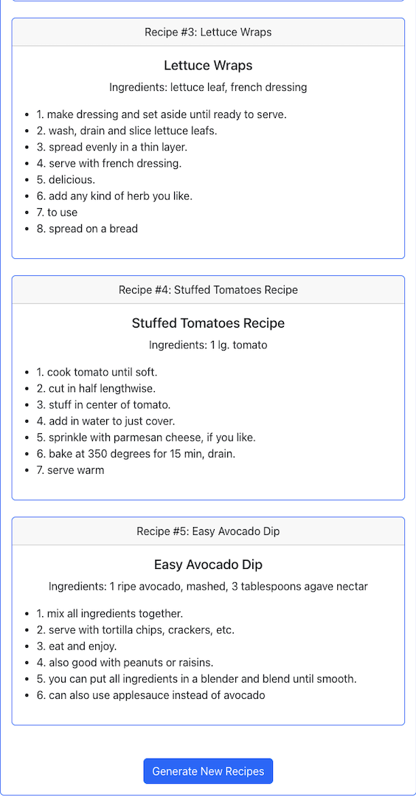

# Snap-Chef

Welcome to Snap-Chef! This is a full-stack application leveraging React, Bootstrap, Node,js, PostgreSQL, and AWS S3 Bucket that leverages computer vision and natural language processing to identify ingredients from user-uploaded images or text and recommend recipes with detailed instructions. Have groceries in your refrigerator or pantry and don't know what to make with them? Snap-Chef is the answer!

1. Image Demo:
<ul>
  <li>
    
    
Home Page

  </li>
  <li>
    
    
Search Page

  </li>
  <li>
    
    
Generate Recipes

  </li>
  <li>
    
    
Generate Recipes cont.

  </li>
</ul>

2. Download dependencies first: 

   - cd backend 
   - pip3 install flask flask-cors (python backend) 
   - pip3 install flax transformers torch torchvision (python backend) 

    

   - npm init -y (express backend) 
   - npm i express axios cors pg multer form-data (express backend) 
   - npm install --save-dev nodemon (express backend) 

    

   - cd frontend 
   - npm install react-bootstrap bootstrap react-router-dom 

3. To run the server: 
   - cd backend > python3 flaskSever.py 
   - cd backend > npm run dev 
